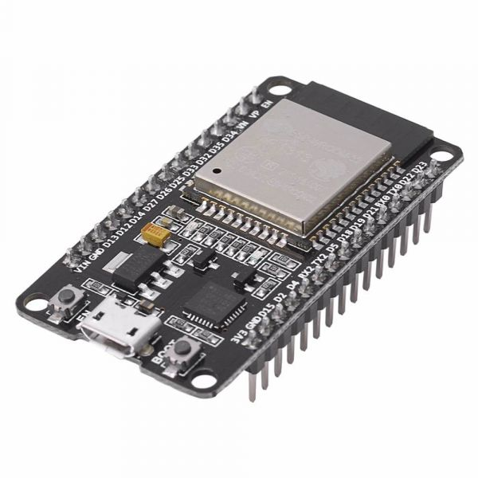
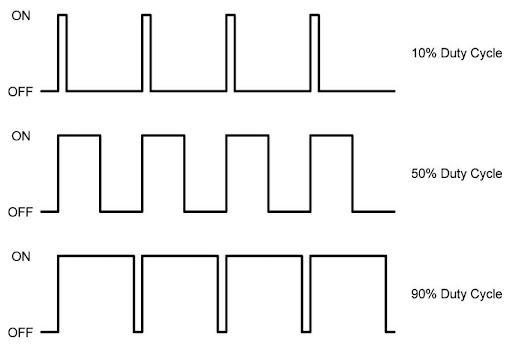
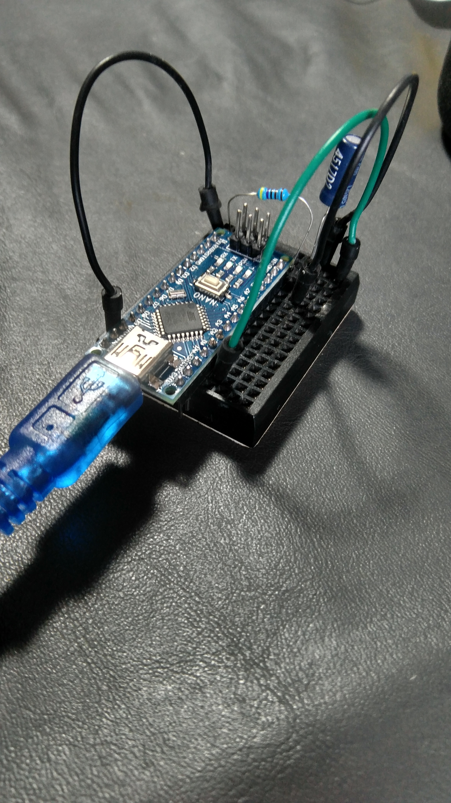
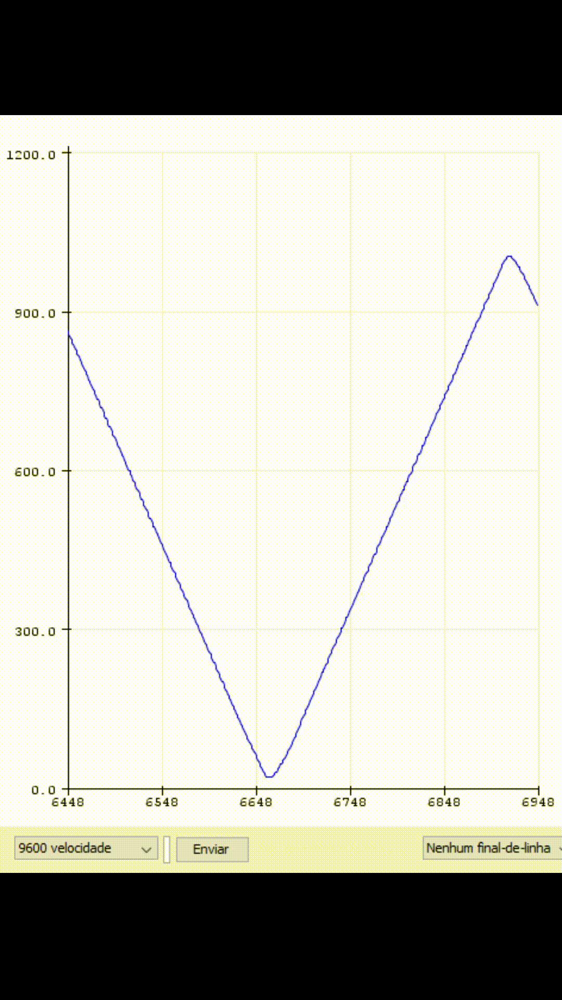
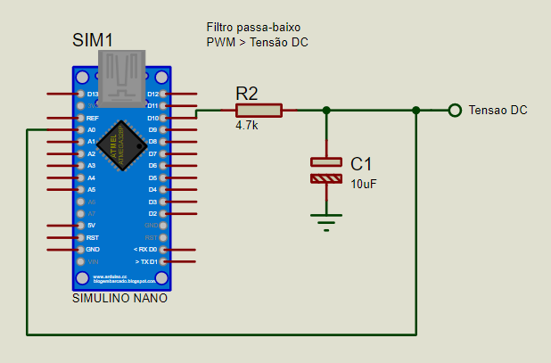
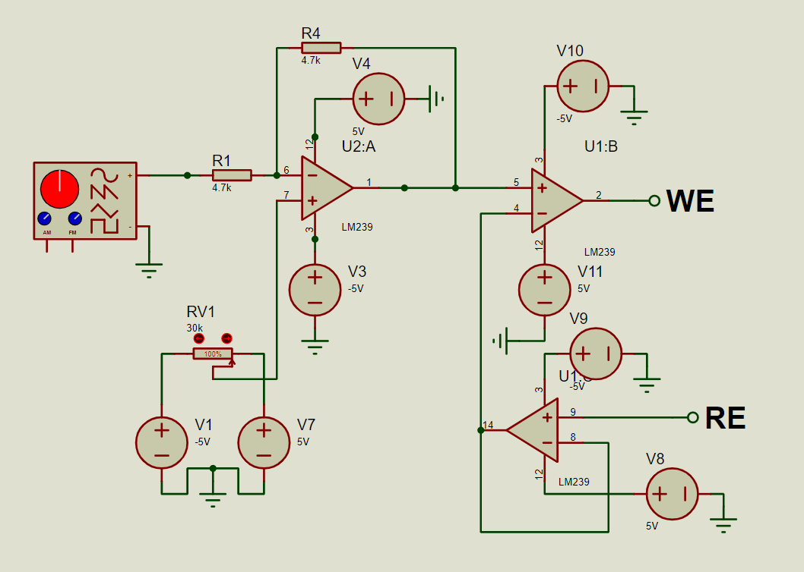
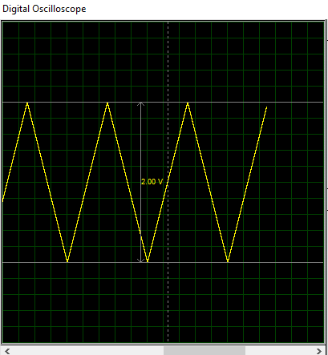
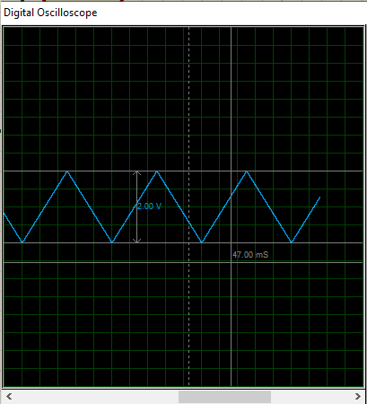
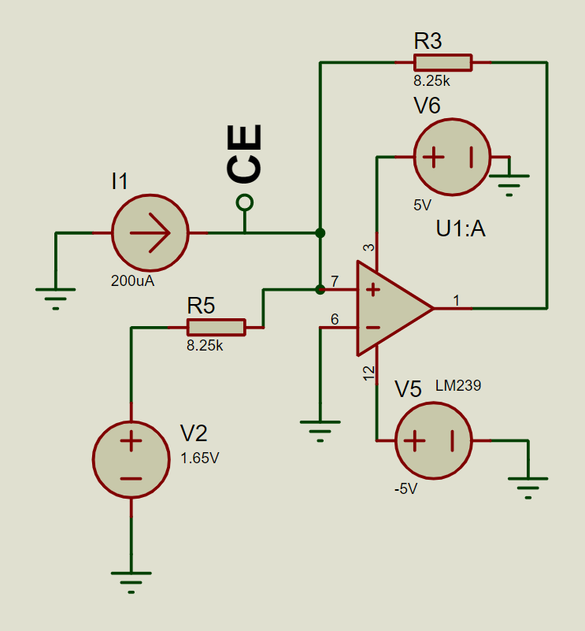
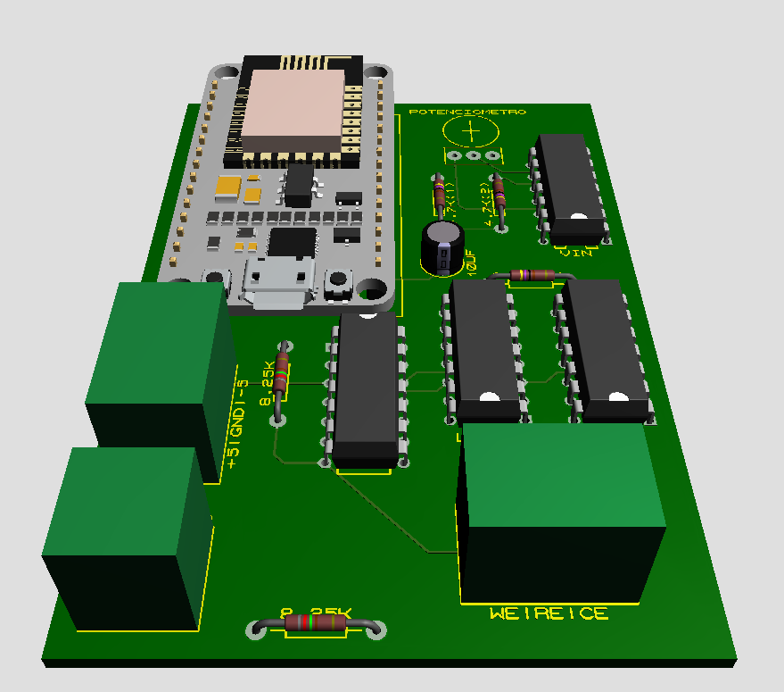

# Sistema de Deteccao e Analise de Soluções Salinas na Água

Elaboração de um projeto capaz de detectar e analisar soluções com a presença de Sal, a fim de utilizar a técnica de Voltametria Cíclica e coletar dados.

## Índice
+ [Sobre](#sobre)
+ [Circuito](#circuito)
+ [Placa de Circuito Impresso](#pcb)
+ [Primeiros Passos](#comecando)
    - [Pré-requisitos](#pre_req)
    - [Instalação](#instalacao)
+ [Uso](#uso)
+ [Referências Bibliográficas](#referencias)

<h2 id="sobre">Sobre</h2>

O objetivo desse projeto é realizar a detecção de Sal na água e realizar uma técnica chamada Voltametria Cíclica. A voltametria cíclica consiste em aplicar um potencial sobre o eletrodo de trabalho e medir a corrente elétrica originada pela variação desse potencial. Para isso, foi criado um potenciostato simples, que é um instrumento capaz de realizar a medição de corrente a partir do potencial, mencionado anteriormente. 

O artigo entitulado "Building a Microcontroller Based Potentiostat: A Inexpensive and Versatile Platform for Teaching Electrochemistry and Instrumentation" [1] foi indispensável para entender o processo de funcionamento e ter as primeiras noções de como o circuito funciona. Segundo Meloni, potenciostatos são dispositivos simples que dependem de amplificadores operacionais para manter a diferença de potencial necessária entre os dois eletrodos (eletrodo de trabalho e referÊncia), imersos na solução enquanto todos os dados de corrente elétricas são gravados. 

O circuito costruído para este experimento, que pode ser visto na figura a seguir, possui adaptações feitas pelo autor desse trabalho para simplificar o processo baseado na saída do Arduino e também no trabalho "Building an Arduino based potentiostat and Instrumentation for Cyclic Voltammetry" [2], que deixa um pouco mais claro o papel dos eletrodos no sistema.

<div align='center'>
    
    <p>Figura 1. Versão inicial de testes funcional</p>
</div>

Os testes iniciais de validação foram feitos com um Arduino Nano, a fim de validar a saída da placa como sendo funcional para um potenciostato. Para a versão final do circuito, foi selecionada a placa NodeMCU ESP32, visto que para aplicações com coleta de dados, integração com internet, consumo de energia e capacidade de processamento são extremamente superiores as do Arduino. Além disso, algumas de suas características suprem certas necessidades que serão discutidas na seção a seguir.

<h2 id="circuito">Esquemático do Circuito</h2>

Para a montagem e simulação do circuito foi utilizado o Software [4]. O uso de um software pago se deu por problemas técnicos e tempo para desenvolvimento. 

Como foi dito, a versão final do circuito envolve o uso de uma NodeMCU com ESP32, como pode ser visto no esquemático a seguir. Devido a falta de esquemáticos específicos para a versão requerida, foi utilizado um modelo de versão anterior, mas na prática o modelo utilizado é o mostrado na outra figura.

<div align='center'>
    
    <p>Figura 2. Versão final do circuito com ESP32</p>
</div>

<div align='center'>
    
    <p>Figura 3. Placa com ESP32 idealizada para a versão real</p>
</div>

O circuito pode ser dividido em partes:

- Parte 1: Preparo do sinal da placa para o potenciostato
- Parte 2: Mudança no offset do nível de tensão para se adequar a diferença de potencial necessária
- Parte 3: Transformar a corrente gerada em tensão

<h3 id='circuito-pt1'><b>Parte 1: Preparo do sinal</b></h3>

Naturalmente uma variação de tensão na saída de uma placa de desenvolvimento se dá através do PWM (do inglês, Modulação por largura de pulso). O PWM gera um sinal com ondas quadradas onde ocorre uma variação apenas no tempo em que a onda passa em nível lógico 1 (conhecido como Duty Cicle). Essa variação, como o próprio nome indica, altera a largura do pulso dado um período de tempo. Um exemplo de sinal com diferentes larguras pode ser visto a seguir:

<div align='center'>
    
    <p>Figura 4. PWM de uma placa</p>
</div>

Esse sinal precisa ser convertido em uma tensão constante, de acordo com as variações do PWM, para que a medição seja precisa e ocorra normalmente, já que é necessário que o comportamento da corrente em relação a diferença de potencial seja estável. Para esse teste foi utilizado um Arduino real para o teste, com valores de resistor e capacitor iguais ao do simulador. O experimento consiste em mostrar que uma onda quadrada pode ter como saída uma triangular, dada uma variação de PWM, com o objetivo de se obter uma tensão DC correspondente ao PWM. 

<div align="center">
    <p float="left">
        
        
    <p>Figura 5. (a) Circuito real para teste do filtro passa-baixo (b) Saída da tensão gerada pelo próprio Arduino</p>
    </p>
</div>

Para a obtenção desse resultado foi utilizado um filtro passa-baixo, que deixa apenas as frequências mais baixas do sinal passarem. Além disso foi necessária uma pequena modificação no código do Arduino para alterar a frequência de saída do sinal PWM, pois por padrão a frequência é baixa. Foi aumentada para 31 kHz. Como dito, a versão final deste projeto utilizaria uma ESP32, que não teria esse problema, pois além de ter uma frequência ampla e configurável, possui também seu próprio circuito conversor digital analógico, facilitando o trabalho. Ainda assim essa parte do circuito é importante para manter as possibilidades de projeto e aplicações.

Na figura 5(b) pode ser observado que os valores vão de quase 0 até acima de 900. Isso ocorre pois o conversor Analógico Digital do Arduino (ADC, do inglês Analogic Digital Converter) possui 10 bits de resolução, ou seja, de acordo com a tensão de entrada (0-5V), captura valores de 0 até 1023. Portanto, os resultados condizem com a saída de PWM.

<div align='center'>
    
    <p>Figura 6. Circuito com filtro passa-baixo</p>
</div>

Para a decisão da frequência de corte a fórmula a seguir foi utilizada:

> Fc = 1/(2 * pi * R * C)

O código utilizado para essa validação consiste em variar o PWM do 0 até o máximo, para obter a tensão mínima e máxima de saída, em forma de onda triangular. A mudança na frequência pode ser consultada em [3], pois outras modificações de frequência também podem ser utilizadas dependendo do caso.

```cpp
// Código criado para ler resultado do filtro passa-baixo e plotar utilizando Serial Plotter
#define PWM_OUTPUT 10
#define analogico A0

void setup() {
  // Inicia porta Serial
  Serial.begin(9600);

  // Configura pinos
  pinMode(PWM_OUTPUT, OUTPUT);
  pinMode(analogico, INPUT);
  
  TCCR1B = TCCR1B & B11111000 | B00000001; //Muda a frequência PWM da porta 10 do Arduino para 31 kHz
}

void loop() {
  // Altera Duty Cicle do PWM de 0% até 100%
  for (int i = 0; i <= 255; i++){
    analogWrite(PWM_OUTPUT, i);
    Serial.println(analogRead(analogico));
    Serial.print(" ");
  }

  // Altera Duty Cicle do PWM de 100% até 0%
  for (int i = 255; i >= 0; i--){
    analogWrite(PWM_OUTPUT, i);
    Serial.println(analogRead(analogico));
    Serial.print(" ");
  }
}
```

<h3 id='circuito-pt2'><b>Parte 2: Mudança do offset</b></h3>

A mudança no offset é necessária para o funcionamento do potenciostato, pois tensões negativas são necessárias para que as variações de um ciclo possam ir do pico negativo até o pico positivo de corrente. Essa saída vai diretamente para os eletrodos de trabalho (WE, do inglês Working Electrode) e eletrodo de referência (RE, do inglês Reference Electrode). 

Dito isso, o circuito responsável pelo offset pode ser visto a seguir:

<div align='center'>
    
    <p>Figura 7. Alteração de offset e saída de eletrodos</p>
</div>

Esses eletrodos serão os responsáveis por gerar a diferença de potencial na solução. Segundo Joshi [2], o Buffer após a correção de offset é necessário para garantir que o potencial nos dois eletrodos (WE e RE) se mantenham iguais e estáveis, nos valores necessários. Essa é uma das principais e qualidades requeridas para que a análise de Voltametria Cíclica seja devidamente realizada.

O circuito de offset possui um potênciometro para que possam ocorrer ajustes na tensão. O trabalho dele é basicamente aumentar e diminuir o nível de tensão para se ajustar ao necessário. Por exemplo, se a entrada baseada na tensão DC que vem do filtro for de 0 até 2V, o circuito de offset deve ser capaz de transformar essa tensão em -1V até 1V.

<div align="center">
    <p float="left">
        
        
    <p>Figura 8. Offset para alteração dos intervalos de tensão</p>
    </p>
</div>

<h3 id='circuito-pt3'><b>Parte 3: Transformação de corrente em tensão</b></h3>

Essa fase implica em utilizar um terceiro eletrodo (CE, do inglês Couter Electrode) para captar toda a corrente elétrica gerada pela diferença de potencial dos eletrodos anteriores. Essa corrente, que vai de negativa até positiva, é transformada em tensão para que a placa possa identificar os resultados e gerar gráficos, para assim finalizar a análise do processo.

<div align='center'>
    
    <p>Figura 9. Amplificador de transresistência ou conversor corrente-tensão</p>
</div>

Os cálculos foram feitos para que, de acordo com a tensão de entrada e resistores, a saída máxima de tensão seja de 3,3V. Isso foi decidido para que tanto Arduinos quanto ESP's, que só trabalham a um nível de tensão de 3,3V, possam ser utilizados para medir o que é necessário para o projeto. A tabela verdade para o circuito pode ser vista a seguir:


<div align='center'>
    <div>
    <table>
    <tbody>
    <tr>
    <td>Entrada</td>
    <td>Sa&iacute;da</td>
    </tr>
    <tr>
    <td>-200uA</td>
    <td>0V</td>
    </tr>
    <tr>
    <td>200uA</td>
    <td>3.3V</td>
    </tr>
    </tbody>
    </table>
    </div>

<p>Tabela 1. Tabela verdade para valores de corrente</p>
</div>

Obs.: Os valores de corrente simulados para essa situação foram baseados no trabalho de [1], visto que, de acordo com a solução testada, as variações de tensão entre -1V e 1V foram utilizadas, já que eram o suficiente para a análise dos resultados pretendidos. Visto que a situação simulada não seria diferente, foram utilizados os mesmos valores como parâmetros para cálculos e testes de simulação.

<h3 id='circuito-pt4'><b>Lista de Materiais</b></h3>

<div align='center'>
    <div>
    <table>
<tbody>
<tr>
<td>Qnt.</td>
<td>Produto</td>
</tr>
<tr>
<td>1</td>
<td>*Arduino Nano</td>
</tr>
<tr>
<td>1</td>
<td>*NodeMCU ESP32</td>
</tr>
<tr>
<td>4</td>
<td>LM239</td>
</tr>
<tr>
<td>3</td>
<td>
<p>Resistor 4.7k</p>
</td>
</tr>
<tr>
<td>2</td>
<td>Resistor 8.2k</td>
</tr>
<tr>
<td>1</td>
<td>
<p>Pot&ecirc;nciometro 30k</p>
</td>
</tr>
<tr>
<td>1</td>
<td>Capacitor 10uF</td>
</tr>
</tbody>
</table>
    </div>

<p>Tabela 2. Lista de materiais utilizados no projeto</p>
</div>

<p><i>* Pode ser uma ou outra placa</i></p> 

<h2 id="pcb">Placa de Circuito Impresso</h2>

<div align="center">
    <p float="left">
        
        
    <p>Figura 9. Design e placa de circuito impresso</p>
    </p>
</div>

<h2 id="comecando">Começando</h2>

Siga estas instruções para criar, replicar e modificar o modelo de app na sua máquina. 

<h3 id='pre_req'>Pré-requisitos</h3>

<h3 id='instalacao'>Instalação</h3>

<h2 id="uso">Uso</h2>


>### Joystick Esquerdo
> Cont

<br/>

> ### Joystick Direito
> Segu

<br/>

>### Botão TakeOff
>Faz o Drone sair do repouso e começar a voar.

<br/>

> ### Botão Land
> Faz o Drone pousar.

<br/>

> ### Botão KeepAlive
> Envia

<br/>

> ### Botão Increase Speed
> Aumenta a velocidade do Drone

<br/>

> ### Botão Decrease Speed
> Diminui a velocidade do Drone

</p>

<h1 id="referencias">Referências Bibliográficas</h1> 

[1] Meloni, Gabriel N. “Building a Microcontroller Based Potentiostat: A Inexpensive and Versatile Platform for Teaching Electrochemistry and Instrumentation”. Journal of Chemical Education, vol. 93, no 7, julho de 2016, p. 1320–22. DOI.org (Crossref), doi:10.1021/acs.jchemed.5b00961.

[2] Joshi, Peetri, e S. Sutrave. “Building an Arduino based potentiostat and Instrumentation for Cyclic Voltammetry”. Journal of Applied Science and Computations, vol. V, no XII, Dezembro de 2018, p. 163–67.

[3] Arduino Playground - TimerPWMCheatsheet. https://playground.arduino.cc/Main/TimerPWMCheatsheet/. Acessado 20 de dezembro de 2020.

[4] Proteus. 8.6, Labcenter.